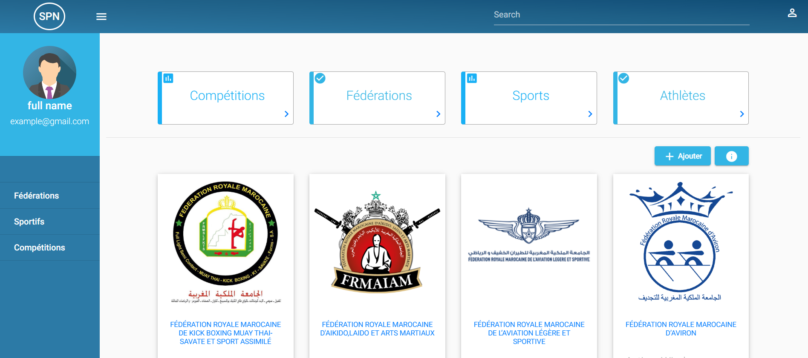
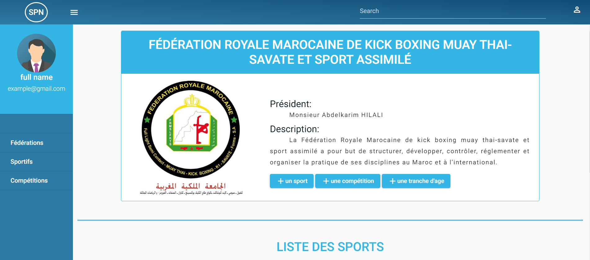
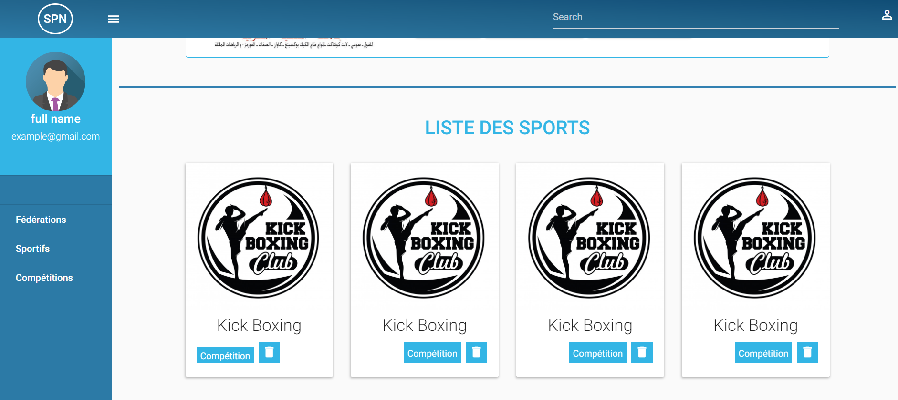

# SPN

This project was generated with [Angular CLI](https://github.com/angular/angular-cli) version 8.3.17.

## Start

Run `npm install` in front-end repo to intall angular project requirements

## Development Spring boot

Run corner store spring boot server for.default port: `http://localhost:8019/`.

## Development Client server

Run `ng serve`. Navigate to `http://localhost:4200/`. server changes will automatically reload in the in the browser

## For dev

font-end folder is the Angular Project
back-end folder is the Spring boot 

## Preview:

## API

API documentation is in `http://localhost:8015/swagger-ui.html`

## Athors: 
* **Hamza HERMACH**  - [HamzaHermach](https://github.com/hermach)
* **Mehdi BZIKHA** 
* **Rahma OMARA**

